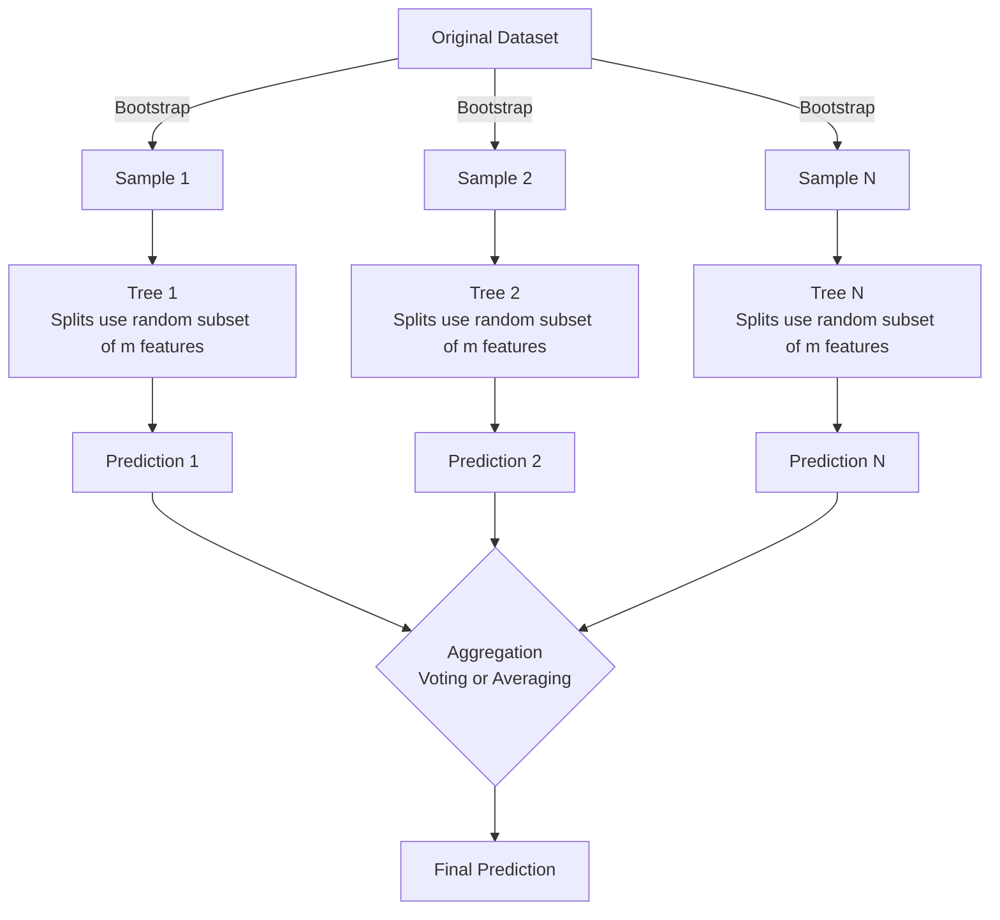

# Topic 5: Ensembles and Random Forest

These notes summarize the concepts of Ensembles, Bagging, Random Forest, and Feature Importance.

## 1. Ensembles and Bootstrapping

**Ensembles** combine multiple machine learning models to produce a single, stronger model. This is conceptually similar to the "Wisdom of the crowd" or Condorcet’s jury theorem, where aggregating many independent decisions leads to a highly accurate combined decision.

**Condorcet’s jury theorem formula:**
If each member of a jury makes an independent judgment with probability $p > 0.5$ of being correct, the probability $\mu$ that the majority of the jury is correct is:
$$ \mu = \sum_{i=m}^{N} {N \choose i} p^i (1-p)^{N-i} $$
where:
- **$\mu$**: The probability that the majority of the jury (ensemble) makes the correct decision.
- **$N$**: The total number of jurors (base models in the ensemble).
- **$m$**: The minimal number of jurors needed for a majority ($m = \lfloor N/2 \rfloor + 1$).
- **${N \choose i}$**: The binomial coefficient, representing the number of ways to choose $i$ correct jurors out of $N$.
- **$p$**: The probability that an individual juror (base model) makes the correct decision.

As $N \to \infty$, the probability of a correct decision $\mu \to 1$.

**Bootstrapping** is a statistical resampling technique used to estimate statistics of a population:
- From a dataset of size $N$, draw $N$ instances **with replacement**.
- The resulting sample will have some duplicates and miss some original instances.
- Repeat this $M$ times to generate $M$ bootstrap samples.

## 2. Bagging (Bootstrap Aggregation)

Bagging uses bootstrapping to create an ensemble of models.

### Algorithm
1. Generate $M$ bootstrap samples from the training set.
2. Train a base classifier $b_i(x)$ on each of the $M$ bootstrap samples.
3. For prediction, aggregate the outputs of all $M$ models:
   - **Classification**: Majority voting.
   - **Regression**: Average the outputs $a(x) = \frac{1}{M} \sum_{i=1}^{M} b_i(x)$.

### Why Bagging Works
Bagging **reduces the variance** of a model without increasing its bias. This makes it an excellent technique to prevent complex models (like deep Decision Trees) from overfitting.

**Variance Reduction Formula:**
Let's assume there exists an ideal target function $y(x)$. The error for each individual regression function $b_i(x)$ is $\varepsilon_i(x)$. The mean expected squared error over all individual regression functions is:
$$ \mathbb{E}_1 = \frac{1}{n} \mathbb{E}_x\left[ \sum_{i=1}^n \varepsilon_i^{2}(x)\right] $$
where:
- **$\mathbb{E}_1$**: The mean expected squared error of the individual regression functions.
- **$n$**: The total number of individual models (trees) in the ensemble.
- **$\mathbb{E}_x$**: The expected value over the input space $x$.
- **$\varepsilon_i(x)$**: The error of the $i$-th individual base model $b_i(x)$ on input $x$ (defined as $\varepsilon_i(x) = b_i(x) - y(x)$).

Assuming the errors are unbiased and uncorrelated, i.e., $\mathbb{E}[\varepsilon_i(x)] = 0$ and $\mathbb{E}[\varepsilon_i(x)\varepsilon_j(x)] = 0$ (for $i \neq j$), the mean squared error of the averaged function $a(x)$ is:
$$ \mathbb{E}\left[ \left( \frac{1}{n}\sum_{i=1}^n b_i(x) - y(x) \right)^2 \right] = \mathbb{E}\left[ \left( \frac{1}{n}\sum_{i=1}^n \varepsilon_i(x) \right)^2 \right] $$
$$ = \frac{1}{n^2} \mathbb{E}\left[ \sum_{i=1}^n \varepsilon_i^2(x) \right] = \frac{1}{n} \mathbb{E}_1 $$
where:
- **$a(x) = \frac{1}{n}\sum_{i=1}^n b_i(x)$**: The aggregated (averaged) prediction of the ensemble.

By averaging the individual answers, the mean squared error (variance) is reduced by a factor of $n$.

### Out-of-Bag (OOB) Error
Since bootstrap samples are drawn with replacement, some instances are never chosen for a particular sample.
$$ \lim_{\ell \to \infty} \left(1 - \frac{1}{\ell}\right)^\ell = \frac{1}{e} \approx 0.368 $$
where:
- **$\ell$**: The total number of instances in the dataset.
- **$\frac{1}{\ell}$**: The probability of selecting a specific instance in a single random draw with replacement.
- **$1 - \frac{1}{\ell}$**: The probability of NOT selecting a specific instance in a single draw.
- **$\left(1 - \frac{1}{\ell}\right)^\ell$**: The probability that a specific instance is never selected after $\ell$ draws.
- **$e$**: Euler's number (approx. $2.71828$), the base of the natural logarithm.

This means each base model is trained on $\approx 63\%$ of the unique data points and leaves out $\approx 37\%$. These left-out instances are called **Out-of-Bag (OOB)** samples. We can use them to evaluate the model's performance natively, without needing a separate validation set or cross-validation. 

---

## 3. Random Forest

Random Forest (by Leo Breiman) is an extension of Bagging applied specifically to Decision Trees, heavily utilizing the **Random Subspace Method** to further decorrelate the trees.

### Algorithm
1. Create $N$ bootstrap samples.
2. Build a Decision Tree for each sample, with one crucial modification:
   - When searching for the best feature to split a node, **randomly select a subset of $m$ features** out of the $d$ total features.
   - Only evaluate splits on these $m$ features.
3. Grow the trees deep (until leaves have $n_{min}$ instances or max depth is reached).
4. Aggregate predictions (majority voting or averaging).

### Key Heuristics
- **Classification**: $m \approx \sqrt{d}$ features per split. Minimum $n_{min} = 1$ sample per leaf node.
- **Regression**: $m \approx \frac{d}{3}$ features per split. Minimum $n_{min} = 5$ samples per leaf node.

### Bias-Variance Tradeoff in Random Forests
- The **bias** of a Random Forest is roughly the same as the bias of a single unpruned decision tree (low bias).
- The **variance** is aggressively reduced through two mechanisms:
  1. Bagging (averaging multiple models).
  2. Feature sub-sampling (decorrelates the trees, so their errors are less likely to overlap).

### Extremely Randomized Trees (ExtraTrees)
A variation where randomness goes one step further: instead of searching for the *best* threshold for the randomly selected $m$ features, the thresholds themselves are drawn at random, and the best of those random thresholds is used. This trades a slight increase in bias for an even larger reduction in variance.

### Similarities to K-Nearest Neighbors
A Random Forest can be viewed conceptually as a smoothed K-Nearest Neighbor algorithm. The response of a random forest is a weighted sum of responses over all training examples:
$$ \hat{y} = \sum_{i=1}^{\ell} W_i(x) y_i $$
where:
- **$\hat{y}$**: The predicted value for the new input $x$.
- **$\ell$**: The number of training examples.
- **$y_i$**: The true label of the $i$-th training example.
- **$W_i(x)$**: The weight of the $i$-th training example. It represents the "similarity" between the training example $x_i$ and the new input $x$, measured by how frequently they fall into the same leaf node across all the trees in the forest. The sum of all weights $\sum_{i=1}^{\ell} W_i(x) = 1$.

---

## 4. Hyperparameter Tuning (Scikit-Learn)

When tuning `RandomForestClassifier` or `RandomForestRegressor`, prioritize these hyperparameters:
- `n_estimators`: Number of trees. More is usually better and doesn't cause overfitting, but eventually performance plateaus while computation time increases.
- `max_depth`: Limits the depth of the trees. A strong regularizer to prevent overfitting.
- `min_samples_leaf`: Minimum number of samples allowed in a leaf. Great for controlling overfitting.
- `max_features`: The $m$ subset size. Adjusting this impacts the correlation between trees.
- `criterion`: Metric to measure split quality (`gini` or `entropy` for classification, `mse` or `mae` for regression).

---

## 5. Feature Importance

One of the massive advantages of Random Forests over deep learning is interpretability through feature importances. There are two primary methods to compute this:

### 1. Permutation Importance
This method evaluates how much the model's accuracy degrades when a feature's values are scrambled.
$$ PI^{(t)}(X_j) = \frac{\sum_{i \in \overline{\mathfrak{B}}^{(t)}} \left[ I(\hat{y}_i^{(t)} = y_i) - I(\hat{y}_{i, \pi_j}^{(t)} = y_i) \right]}{|\overline{\mathfrak{B}}^{(t)}|} $$
where:
- **$PI^{(t)}(X_j)$**: The permutation importance of feature $X_j$ in a specific tree $t$.
- **$\overline{\mathfrak{B}}^{(t)}$**: The Out-of-Bag (OOB) sample for tree $t$ (the instances not used to train this tree).
- **$|\overline{\mathfrak{B}}^{(t)}|$**: The total number of instances in the OOB sample for tree $t$.
- **$i$**: An index representing a single observation (instance) in the OOB sample.
- **$y_i$**: The true target label for instance $i$.
- **$\hat{y}_i^{(t)}$**: The predicted class for instance $i$ by tree $t$ *before* any permutation.
- **$\hat{y}_{i, \pi_j}^{(t)}$**: The predicted class for instance $i$ by tree $t$ *after* the values of feature $X_j$ have been randomly permuted (shuffled).
- **$I(\cdot)$**: The indicator function, which equals $1$ if the condition inside is true (e.g., prediction matches the true label), and $0$ otherwise.

The non-normalized feature importance is the average over all $N$ trees:
$$ PI(X_j) = \frac{\sum_{t=1}^N PI^{(t)}(X_j)}{N} $$
Normalized importance:
$$ z_j = \frac{PI(X_j)}{\frac{\hat{\sigma}}{\sqrt{N}}} $$
where:
- **$N$**: The total number of trees in the Random Forest.
- **$PI(X_j)$**: The non-normalized, average permutation importance of feature $X_j$ across all $N$ trees.
- **$z_j$**: The normalized feature importance score for feature $X_j$.
- **$\hat{\sigma}$**: The standard deviation of the accuracy differences ($PI^{(t)}(X_j)$) across all trees. A high drop in accuracy implies high importance.

### 2. Impurity-based Importance (Sklearn method)
This method measures how much a feature contributes to reducing impurity (e.g., Gini impurity, Entropy, or MSE) across all the nodes where it is used to split the data.
$$ RI_i^{(t)} = w_i^{(t)} \cdot I_i^{(t)} - w_{LEFT_i}^{(t)} \cdot I_{LEFT_i}^{(t)} - w_{RIGHT_i}^{(t)} \cdot I_{RIGHT_i}^{(t)} $$
where:
- **$RI_i^{(t)}$**: The reduction in impurity achieved by the split at node $i$ in tree $t$.
- **$w_i^{(t)}$**: The weighted number of samples (proportion of total samples) reaching node $i$.
- **$I_i^{(t)}$**: The impurity of the data at node $i$ (e.g., Gini impurity for classification, MSE for regression).
- **$w_{LEFT_i}^{(t)}, w_{RIGHT_i}^{(t)}$**: The weighted number of samples reaching the left and right child nodes of node $i$.
- **$I_{LEFT_i}^{(t)}, I_{RIGHT_i}^{(t)}$**: The impurity of the left and right child nodes.

$$ FI_j^{(t)} = \frac{\sum_{i: \text{ node } i \text{ splits on } X_j} RI_i^{(t)}}{\sum_{i \in \text{all nodes}} RI_i^{(t)}} $$
where:
- **$FI_j^{(t)}$**: The feature importance of feature $X_j$ in tree $t$.
- The **numerator** sums the impurity reductions ($RI_i^{(t)}$) for all nodes $i$ in tree $t$ that use feature $X_j$ for splitting.
- The **denominator** normalizes the score by dividing by the sum of impurity reductions across all nodes in the tree, ensuring that all feature importances in the tree sum to 1.

The final feature importance is the average of $FI_j^{(t)}$ over all $N$ trees in the forest. High average impurity reduction = High importance.

**Example**: In predicting a hostel's overall rating, analyzing the Random Forest's feature importance might show that `Staff` and `Value for money` have much higher impurity-reduction scores than `Room condition`, indicating that customers care more about service and price than the room itself.
